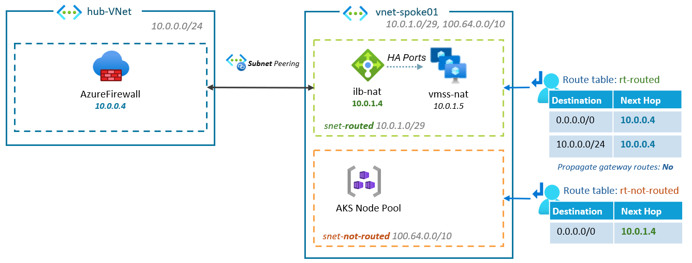

# Home-made Private NAT Gateway in Azure

As of today, Azure does not natively provide a **Private NAT Gateway** solution. 

A **Private NAT Gateway** is a useful for scenarios where multiple networks must interconnect but share overlapping RFC1918 address spaces — a common challenge when available private IP ranges are exhausted.

This article presents two solutions to address this gap.

> [!NOTE]  
> While Azure offers a managed NAT Gateway for outbound Internet connectivity, it does not address internal-only NAT between private networks.

## Example: AKS with non-routed Node Pool subnet

Assume the following topology:
* An AKS Node Pool is deployed in a non-routed subnet  *snet-not-routed (100.64.0.0/10)*
* A small, routable subnet *snet-routed (100.0.1.0/29)*, is used for egress, hosting instances that will perform SNAT
* `vnet-spoke01` is peered with `hub-VNet`. To avoid propagating *snet-not-routed* range, use:
  * [Subnet peering feature](https://learn.microsoft.com/en-us/azure/virtual-network/how-to-configure-subnet-peering), in a Hub&Spoke model
  * [Route-maps](https://learn.microsoft.com/en-us/azure/virtual-wan/route-maps-about) inbound rule, in a Virtual WAN model

> [!NOTE]  
> This article do not cover the ingress controller aspect, which could involved another small subnet within `vnet-spoke01`


How can we ensure that all network traffic from the Node Pool passes through the *snet-routed* subnet ?

## Solution #1: Home-Made Private NAT Gateway 

This DIY solution involves the following:
* Deploy a (multi-AZ) VMSS in the *snet-routed* subnet
* Provision an Internal Load Balancer (ILB)
    * Frontend IP: *snet-routed*
    * Backend Pool: VMSS
    * Load Balancing Rule: HA Ports
* Route all traffic from the *snet-not-routed* subnet to the ILB's frontend IP using a Route Table.
* Configure VMSS instances to perform NAT on all the traffic (see example below)
* Optionally, add a route for VMSS egress into the Hub's firewall.

**Diagram**:



VMSS instances must be configured to perform SNAT on traffic originating from the AKS Node Pool as it exits through their network interfaces. 

This configuration can be implemented using basic `iptables`:

```bash
# Configuration for the first VMSS instance
iptables -t nat 
    -A POSTROUTING 
    -s 100.64.0.0/10 
    -o eth0 
    -d 10.0.0.0/8 
    -j SNAT 	
    --to-source 10.0.1.5
```

> [!NOTE]  
> [IP forwarding](https://learn.microsoft.com/en-us/azure/virtual-network/virtual-network-network-interface?tabs=azure-portal#enable-or-disable-ip-forwarding) must be enabled at VMSS NICs level.

**Advantages**:
- Low-cost solution
- Few routable IPs used (/29, the minimum)
- Scalable & resilient using VMSS

**Drawbacks**: 
- This is not a managed service
- Create a short init script to configure iptables on the VM according to its network interface.

## Solution #2: Azure Firewall 

The second solution consists of:
* Deploy Azure Firewall into a dedicated *AzureFirewallSubnet* that will be routed (minimum /26 is required)
  * Configure the Azure Firewall Policy to always perform SNAT.
* Route *snet-not-routed* subnet to forward all outbound traffic to the Azure Firewall's private IP.

**Diagram**:


**Advantages**:
- Fully managed and supported by Azure
- Supports both SNAT & DNAT scenarios natively.
- Integrated with Azure monitoring and loging

**Drawbacks**: 
- Rquires a larger subnet (/26 minimum) compared to the /29 neeeded for VMSS.
- Higher Cost: Azure Firewall (Basic SKU) is ~$288 monthly

# Conclusion

Azure doesn’t yet offer a native Private NAT Gateway, but you can bridge this gap with either a lightweight VMSS-based solution or the managed Azure Firewall. Each approach balances tradeoffs between operational complexity, cost, and required subnet size.

Until a built-in option is released, these methods let you securely connect networks with overlapping addresses, keeping your Azure architectures both robust and scalable.